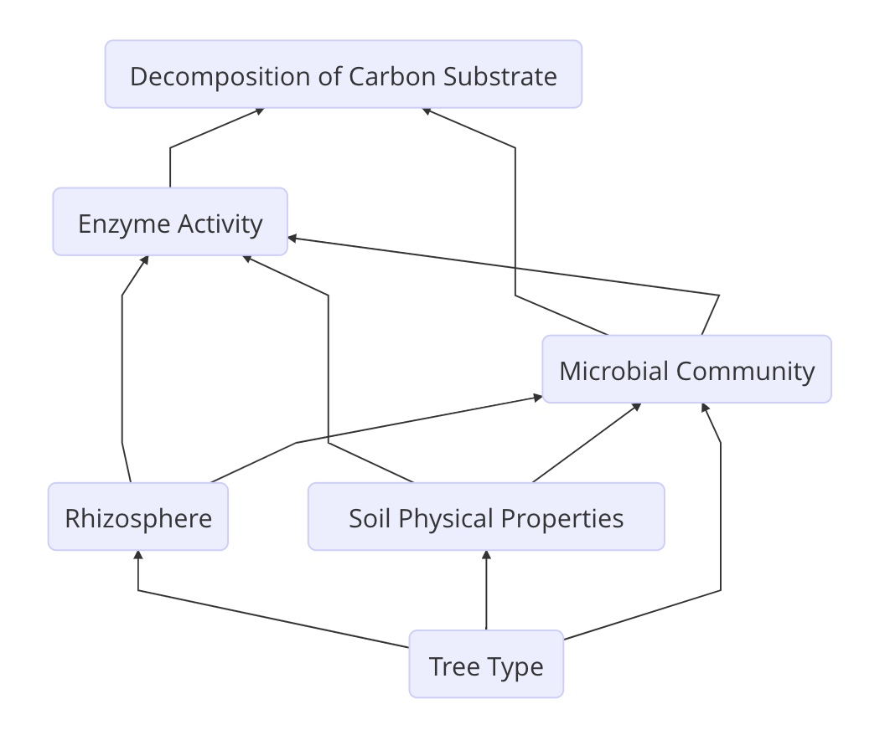
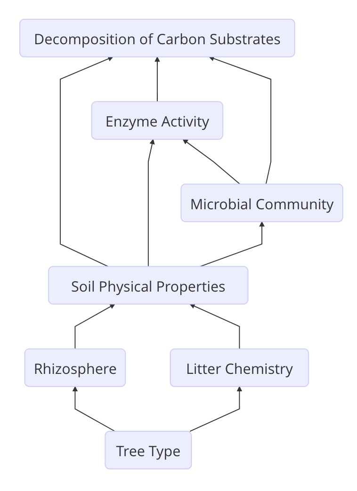

This path diagram illustrates **Hypothesis 1**: Decomposition of starch and leaf substrates in a tropical forest is mediated by the above- and below-ground linkages that influence microbial community dynamics.

\
\
\



This path diagram illustrates **Hypothesis 2**: The activity of the microbial community involved in the decomposition of carbon substrates is influenced primarily by edaphic properties. Above-ground plant community and rhizosphere dynamics can impact decomposition indirectly by shaping the belowground abiotic environment.

\
\
\

```{r echo=FALSE, warning=FALSE, results='asis'}
library(knitr)
setwd("~/Desktop")
myTable<-read.csv("Dip_Switch_Test.csv")
kable(myTable,caption="Dip-Switch Test",col.names=c("Rhizosphere Manipulation","Carbon Substrate Addition","Tree Type","Interpretation"))
```

This table shows a Dip-Switch test for this experiment, where + indicates a significant relationship between decomposition rates of added substrates and the treatment listed in each column. An interpretation of the ecological meaning of each possible combination of results is given in the fourth column.