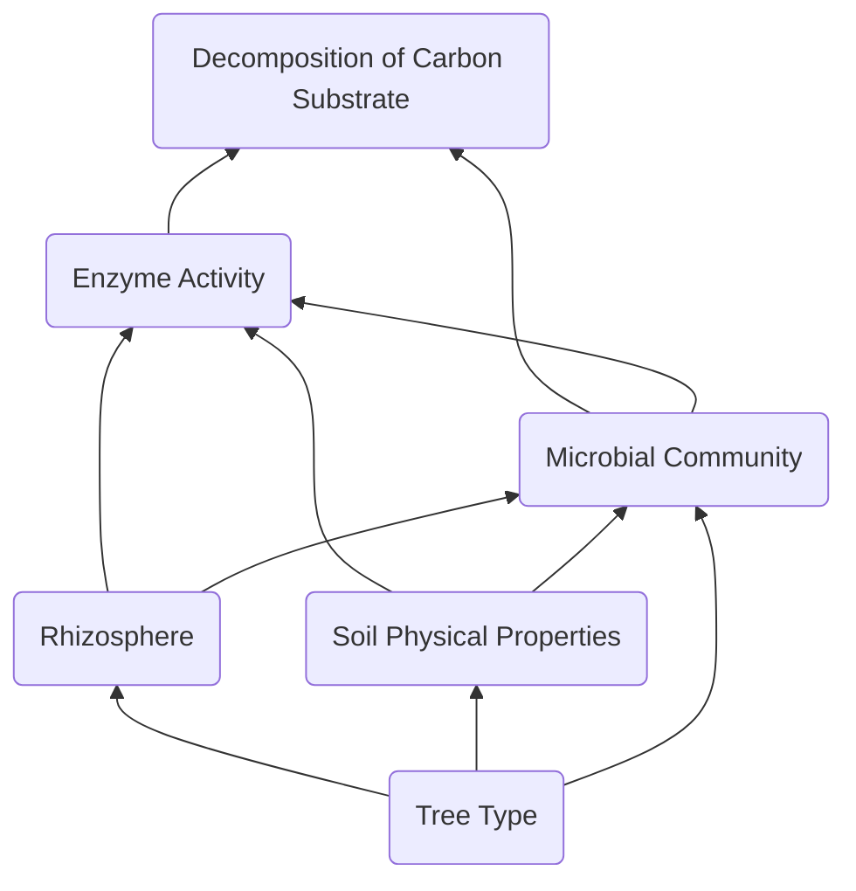

```mermaid
graph BT
A(Tree Type) --> B(Rhizosphere)
A --> C(Soil Physical Properties)
A --> D(Microbial Community)
B --> E(Enzyme Activity)
B --> D
C --> E
C --> D
D --> F(Decomposition of Carbon Substrate)
D --> E
E --> F
```
This is the BIOTIC path diagram (soil properties indirectly influence decomposition through microbial function)

LR = left right, TD = top down, BT = bottom top