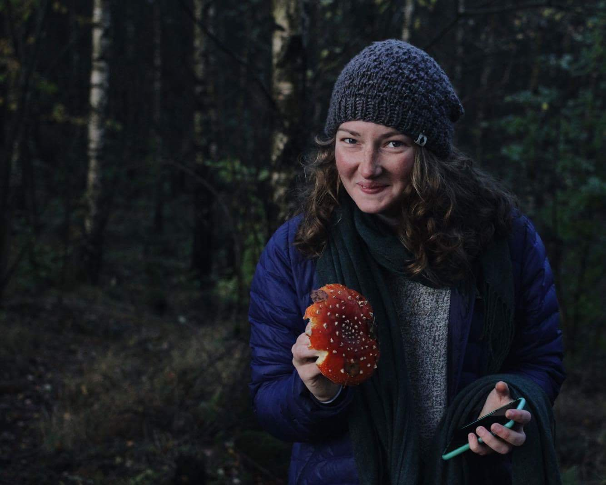

*Index page successfully built.*

**Contact:** kenna.rewcastle@uvm.edu  
  
I'm on [Twitter](https://twitter.com/kennarewcastle?lang=en)

[RMarkdown Cheatsheet](https://www.rstudio.com/wp-content/uploads/2015/02/rmarkdown-cheatsheet.pdf)   